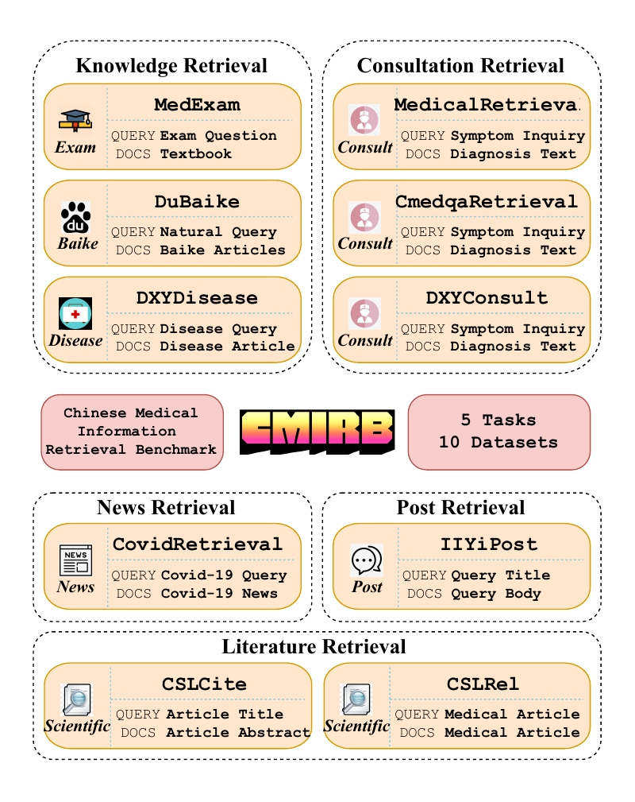

<h1 align="center">Chinese Medical Information Retrieval Benchmark</h1>
<p align="center">
    <a href="https://www.python.org/">
            
    </a>
    <a href="https://arxiv.org/abs/XXXX">
        
    </a>
    <a href="https://huggingface.co/CMIRB">
        
    </a>
    <a href="https://www.python.org/">
        
    </a>
</p>

<h4 align="center">
    <p>
        <a href=#description>Description</a> | 
        <a href=#installation>Installation</a> | 
        <a href=#evaluation>Evaluation</a>  |
        <a href="#leaderboard">Leaderboard</a> |
        <a href="#datasets">Datasets</a> |
        <a href="#acknowledgement">Acknowledgement</a> |
    <p>
</h4>

## Description
CMIRB (Chinese Medical Information Retrieval Benchmark) is a specialized multi-task dataset designed specifically for medical information retrieval. It consists of data collected from various medical online websites, encompassing 5 tasks and 10 datasets, and has practical application scenarios.

<p align="center">
    
</p>

## Installation
CMIRB is developed based on [C-MTEB](https://github.com/FlagOpen/FlagEmbedding/tree/master/C_MTEB). 
You can refer to [C-MTEB](https://github.com/FlagOpen/FlagEmbedding/tree/master/C_MTEB) for setting up the environment. 

These packages are necessary: transformers, datasets, beir, mteb.

## Evaluation

### Evaluate embedding model
* **With our scripts**

You can **reproduce the results of [baai-general-embedding (bge)](https://huggingface.co/BAAI/bge-large-zh-v1.5)** using the provided python script (see [eval_CMIRB.py](./eval_CMIRB.py) )
```bash
python eval_CMIRB.py --model_name_or_path BAAI/bge-large-zh-v1.5
```

* **With C-MTEB scripts** 

You can directly evaluate MIR tasks within the [C-MTEB](https://github.com/FlagOpen/FlagEmbedding/tree/master/C_MTEB) code framework. 
Simply create a new task in [Retrieval.py](https://github.com/FlagOpen/FlagEmbedding/blob/master/C_MTEB/C_MTEB/tasks/Retrieval.py), following the structure of the [MedExamRetrieval](./CMIRB/tasks/Retrieval.py).

Then, you can conduct evaluations 
```python
evaluation = MTEB(tasks=["MedExamRetrieval"], task_langs=['zh', 'zh-CN'])
```

## Leaderboard

### Information Retrieval 
| Model | Dim. | Avg. | MedExam | DuBaike | DXYDisease | Medical | Cmedqa | DXYConsult | Covid | IIYiPost | CSLCite | CSLRel |  
|:-------------------------------|:--------:|:--------:|:--------:|:--------:|:--------:|:--------:|:--------:|:--------:|:--------:|:--------:|:--------:|:--------:|
| [text2vec-large-zh](https://huggingface.co/GanymedeNil/text2vec-large-chinese) | 1024 | 30.56 | 41.39 | 21.13 | 41.52 | 30.93 | 15.53 | 21.92 | 60.48 | 29.47 | 20.21 | 23.01 |
| [mcontriever(masmarco)](https://huggingface.co/facebook/mcontriever-msmarco) | 768 | 35.20 | 51.5  | 22.25 | 44.34 | 38.5  | 22.71 | 20.04 | 56.01 | 28.11 | 34.59 | 33.95 |
| [bm25](https://huggingface.co/BAAI/bge-large-zh-v1.5) | - | 35.35 | 31.95 | 17.89 | 40.12 | 29.33 | 6.83  | 17.78 | 78.9  | 66.95 | 33.74 | 29.97 |
| [text-embedding-ada-002](https://openai.com/index/new-and-improved-embedding-model/) | - | 42.55 | 53.48 | 43.12 | 58.72 | 37.92 | 22.36 | 27.69 | 57.21 | 48.6  | 32.97 | 43.4  |
| [m3e-large](https://huggingface.co/moka-ai/m3e-large) | 768 | 45.25 | 33.29 | 46.48 | 62.57 | 48.66 | 30.73 | 41.05 | 61.33 | 45.03 | 35.79 | 47.54 |
| [multilingual-e5-large](https://huggingface.co/intfloat/multilingual-e5-large) | 1024 | 52.08 | 53.96 | 53.27 | 72.1  | 51.47 | 28.67 | 41.35 | 75.54 | 63.86 | 42.65 | 37.94 |
| [piccolo-large-zh](https://huggingface.co/sensenova/piccolo-large-zh) | 1024 | 54.75 | 43.11 | 45.91 | 70.69 | 59.04 | 41.99 | 47.35 | 85.04 | 65.89 | 44.31 | 44.21 |
| [gte-large-zh](https://huggingface.co/sensenova/piccolo-large-zh) | 1024 | 55.40 | 41.22 | 42.66 | 70.59 | 62.88 | 43.15 | 46.3  | 88.41 | 63.02 | 46.4  | 49.32 |
| [bge-large-zh-v1.5](https://huggingface.co/BAAI/bge-large-zh-v1.5) | 1024 | 55.40 | 58.61 | 44.26 | 71.71 | 59.6  | 42.57 | 47.73 | 73.33 | 67.13 | 43.27 | 45.79 |
| [peg](https://huggingface.co/TownsWu/PEG) | 1024 | 57.46 | 52.78 | 51.68 | 77.38 | 60.96 | 44.42 | 49.3  | 82.56 | 70.38 | 44.74 | 40.38 |

## Datasets
The data preprocessing process can be seen in [data_collection_and_processing](./docs/data_collection_and_processing.md).

An overview datasets available in CMIRB is provided in the following table:

| Name |  Hub URL | Description | Query #Samples | Doc #Samples | 
|:-----:|:-----:|:---------------------------:|:-----:|:-----:|
| [MedExamRetrieval](https://arxiv.org/abs/xxxx) | [CMIRB/MedExamRetrieval](https://huggingface.co/datasets/CMIRB/MedExamRetrieval) | Medical multi-choice exam  | 697 | 27,871 |
| [DuBaikeRetrieval](https://arxiv.org/abs/xxxx) | [CMIRB/DuBaikeRetrieval](https://huggingface.co/datasets/CMIRB/DuBaikeRetrieval) | Medical search query from BaiDu Search  | 318 | 56,441 |
| [DXYDiseaseRetrieval](https://arxiv.org/abs/xxxx) | [CMIRB/DXYDiseaseRetrieval](https://huggingface.co/datasets/CMIRB/DXYDiseaseRetrieval) | Disease question from medical website  | 1,255 | 54,021 |
| [MedicalRetrieval](https://arxiv.org/abs/2203.03367) | [CMIRB/MedicalRetrieval](https://huggingface.co/datasets/C-MTEB/MedicalRetrieval) | Passage retrieval dataset collected from Alibaba search engine systems in medical domain | 1,000  | 100,999 |
| [CmedqaRetrieval](https://aclanthology.org/2022.emnlp-main.357.pdf) | [CMIRB/CmedqaRetrieval](https://huggingface.co/datasets/C-MTEB/CmedqaRetrieval) |  Online medical consultation text | 3,999 | 100,001 |
| [DXYConsultRetrieval](https://arxiv.org/abs/xxxx) | [CMIRB/DXYConsultRetrieval](https://huggingface.co/datasets/CMIRB/DXYConsultRetrieval) | Online medical consultation text  | 943 | 12,577 |
| [CovidRetrieval](https://aclanthology.org/2022.emnlp-main.357.pdf) | [CMIRB/CovidRetrieval](https://huggingface.co/datasets/C-MTEB/CovidRetrieval) | COVID-19 news articles | 949  | 100,001 |
| [IIYiPostRetrieval](https://arxiv.org/abs/xxxx) | [CMIRB/IIYiPostRetrieval](https://huggingface.co/datasets/CMIRB/IIYiPostRetrieval) | Medical post articles  | 789 | 27,570 |
| [CSLCiteRetrieval](https://arxiv.org/abs/xxxx) | [CMIRB/CSLCiteRetrieval](https://huggingface.co/datasets/CMIRB/CSLCiteRetrieval) | Medical literature citation prediction  | 573 | 36,703 |
| [CSLRelatedRetrieval](https://arxiv.org/abs/xxxx) | [CMIRB/CSLRelatedRetrieval](https://huggingface.co/datasets/CMIRB/CSLRelatedRetrieval) | Medical similar literatue  | 439 | 36,758 |


 
## Acknowledgement

We thank the great tool from [FlagEmbedding](https://github.com/FlagOpen/FlagEmbedding)  and the open-source datasets from Chinese NLP community.


## Citation

If you find this repository useful, please consider citation

```
@misc{automir,
      title={AutoMIR: Effective Zero-Shot Medical Information Retrieval without Relevance Labels}, 
      author={Lei Li and Xiangxu Zhang and Xiao Zhou and Zheng Liu},
      year={2024},
      eprint={24xxxxx},
      archivePrefix={arXiv},
      primaryClass={cs.CL}
}
```
